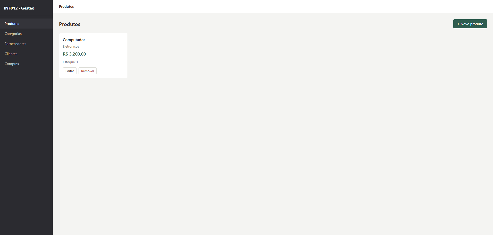

# TRABALHO-INF012 — Sistema de Gestão de Estoque com Microsserviços

<p align="center">
  
</p>

Sistema desenvolvido para a disciplina **INF012 — Programação para Web** do IFBA, implementado com arquitetura de microsserviços em Spring Boot e frontend React.JS.

Equipe:
- [Caio Amorim](https://github.com/CaioGabriel777)
- [Luan Guimarães](https://github.com/LuanVitorRibeiroGuimaraes)
- [Enzo Calado](https://github.com/enzo-gabrielcruz)
- [João Neto](https://github.com/JoaoMoraisNeto)

---

## Arquitetura

O sistema é composto por **4 microsserviços independentes**, um frontend React e uma infraestrutura de suporte orquestrada via Docker Compose.

```
Frontend (React)
    │
    ├── REST ──► inventory  ──► [RabbitMQ: estoque.exchange]
    │                                    │
    ├── REST ──► cliente                 │
    │               ▲                   │
    └── REST ──► compras                │
                    │                   ▼
                    │ OpenFeign   [RabbitMQ: compra.exchange]
                    │                   │
                    └────────────────► email ──► MailHog (SMTP)
```

---

## Microsserviços

| Serviço | Porta | Responsabilidade |
|---|---|---|
| **inventory** | 8081 | Gestão de produtos, categorias, fornecedores e estoque |
| **cliente** | 8082 | Cadastro de clientes e endereços |
| **compras** | 8083 | Registro e controle de pedidos de compra |
| **email** | 8084 | Disparo de e-mails reativos a eventos do sistema |
| **frontend** | 3000 | Interface web em React |

### Fluxo de status de uma compra

```
PENDENTE ──► CONFIRMADA ──► CONCLUIDA
    └──────────────────────► CANCELADA
```

---

## Infraestrutura

| Serviço | Imagem | Porta |
|---|---|---|
| **PostgreSQL** | `postgres:16-alpine` | 5433 |
| **RabbitMQ** | `rabbitmq:3-management-alpine` | 5672 / 15672 |
| **MailHog** | `mailhog/mailhog` | 1025 / 8025 |

---

## Stack Tecnológica

- **Java 21** + **Spring Boot 4.0.7**
- **Spring Data JPA** + **PostgreSQL**
- **Spring AMQP** (RabbitMQ)
- **OpenFeign** (comunicação síncrona entre `compras` e `cliente`)
- **Springdoc OpenAPI** (Swagger UI em cada serviço)
- **React** (frontend)
- **Docker** + **Docker Compose**

---

## Como executar

### Pré-requisitos

- Docker e Docker Compose instalados

### Subindo todos os serviços

```bash
docker compose up --build
```

### Acessos

| Interface | URL |
|---|---|
| Frontend | http://localhost:3000 |
| Swagger — inventory | http://localhost:8081/swagger-ui.html |
| Swagger — cliente | http://localhost:8082/swagger-ui.html |
| Swagger — compras | http://localhost:8083/swagger-ui.html |
| RabbitMQ Management | http://localhost:15672 (guest/guest) |
| MailHog | http://localhost:8025 |

---

## Eventos RabbitMQ

| Publisher | Exchange | Routing Key | Consumer |
|---|---|---|---|
| inventory | `estoque.exchange` | `produto.cadastrado` | email |
| inventory | `estoque.exchange` | `produto.atualizado` | email |
| inventory | `estoque.exchange` | `produto.removido` | email |
| inventory | `estoque.exchange` | `estoque.critico` | email |
| compras | `compra.exchange` | `compra.realizada` | email |

---

## Estrutura do repositório

```
TRABALHO-INF012/
├── cliente/          # Microsserviço de clientes
├── compras/          # Microsserviço de compras (usa OpenFeign)
├── email/            # Microsserviço de e-mail (apenas consumidor RabbitMQ)
├── inventory/        # Microsserviço de estoque
├── frontend/         # Aplicação React
├── utils/            # Utilitários compartilhados
└── docker-compose.yml
```
